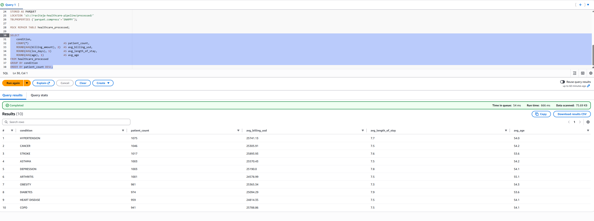

# AWS Healthcare ETL Pipeline

End-to-end batch pipeline on AWS — generates healthcare data,
uploads to S3, transforms with Glue PySpark, queries with Athena.

## Architecture
Raw CSV → S3 → AWS Glue (PySpark) → S3 Parquet → Athena SQL

## Tech Stack
Python · AWS S3 · AWS Glue · Amazon Athena · PySpark · Parquet

## Screenshots

### Athena Query Results


## How to Run
1. pip install -r requirements.txt
2. python src/generate_and_upload.py
3. Run glue_etl_job.py in AWS Glue console
4. Query with athena_queries.sql in Athena
```

6. Scroll down → click the green **"Commit changes"** button → click **"Commit changes"** again in the popup

---

## Step 5 — Verify It Looks Right

1. Go back to the main page of your repo
2. Scroll down — you'll see the README with your screenshot displayed like this:
```
┌─────────────────────────────────────────────┐
│  AWS Healthcare ETL Pipeline                │
│                                             │
│  Architecture                               │
│  Raw CSV → S3 → Glue → S3 Parquet → Athena │
│                                             │
│  Screenshots                                │
│  ┌─────────────────────────────────────┐   │
│  │  [your athena screenshot here]      │   │
│  └─────────────────────────────────────┘   │
└─────────────────────────────────────────────┘
